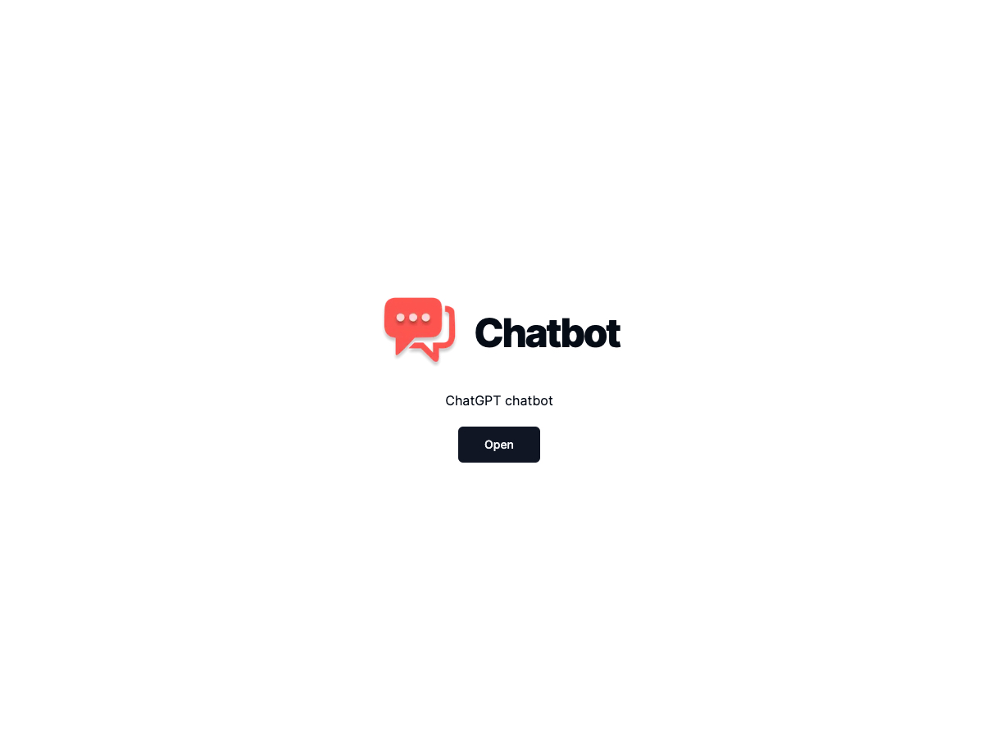
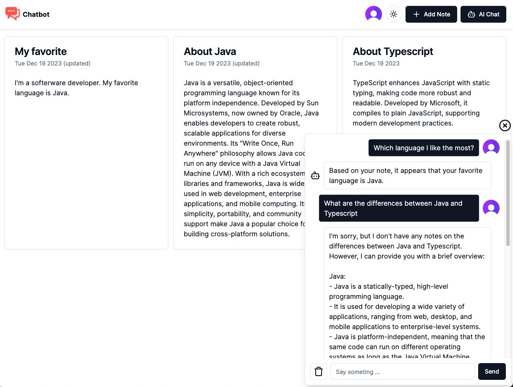
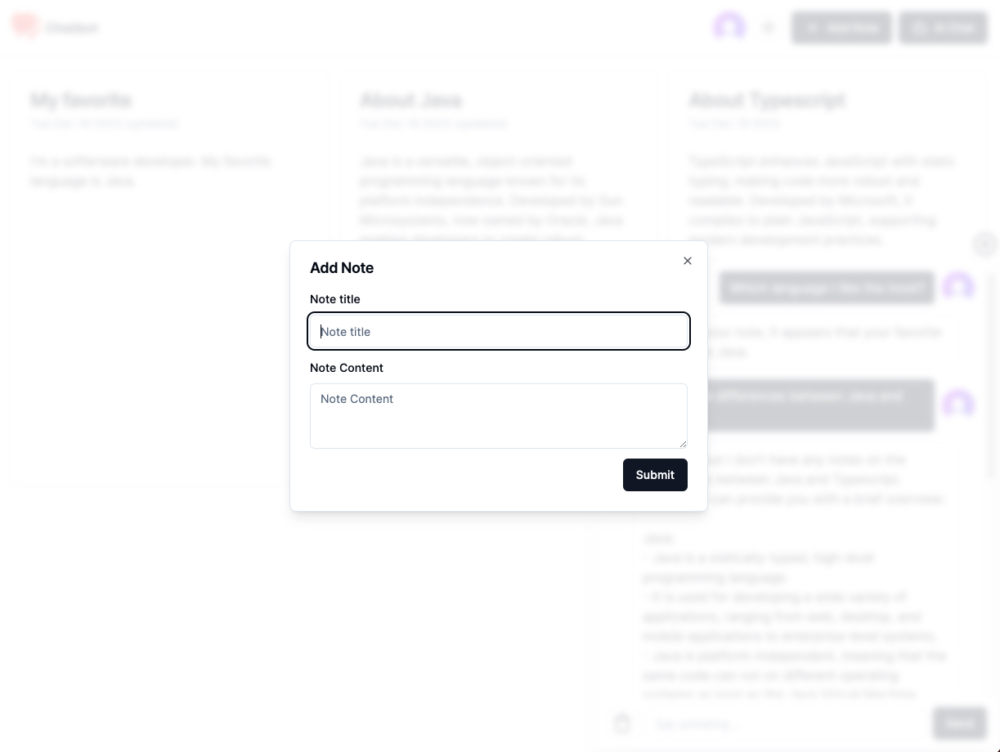
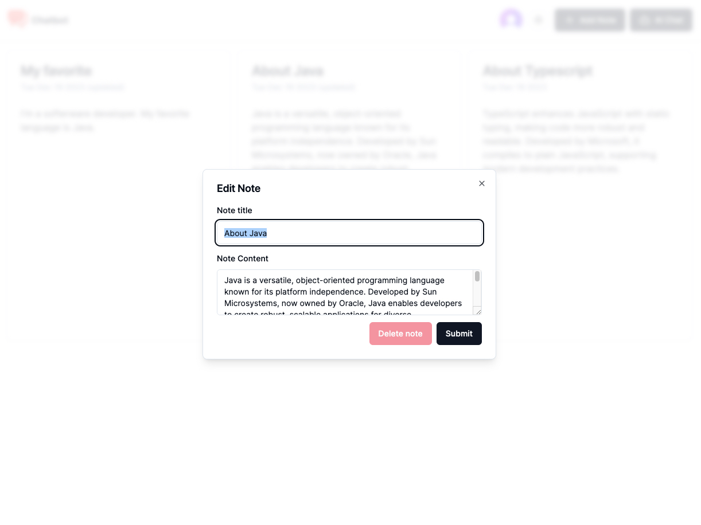
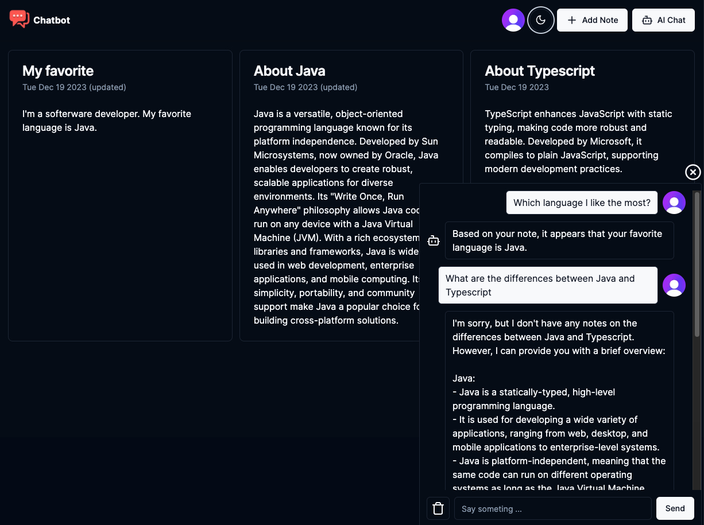
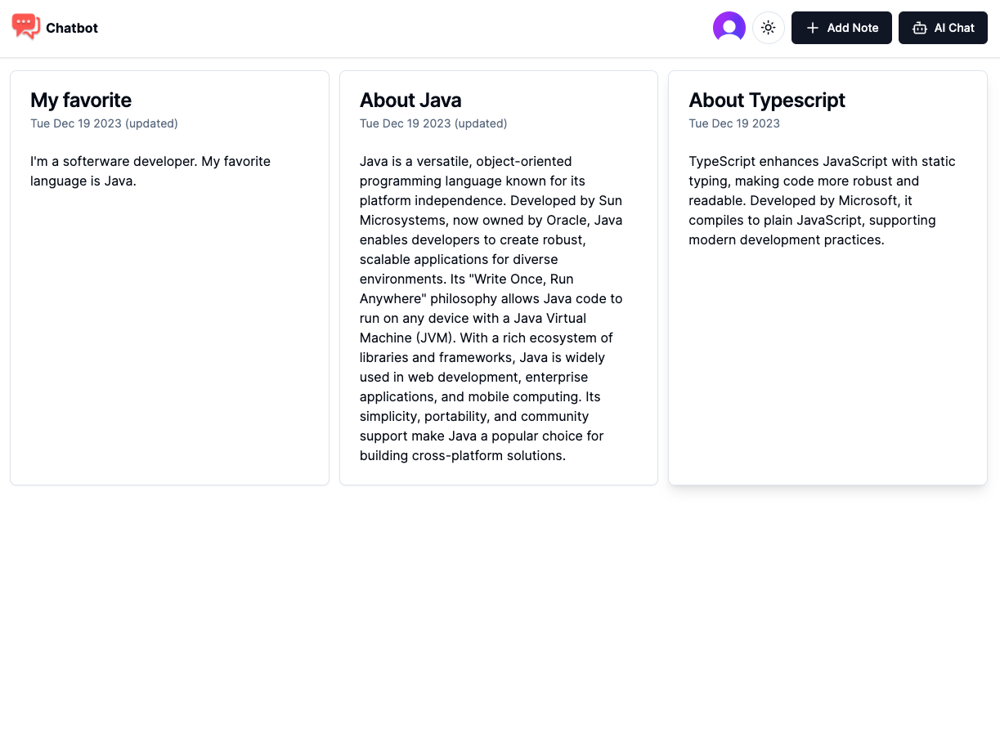
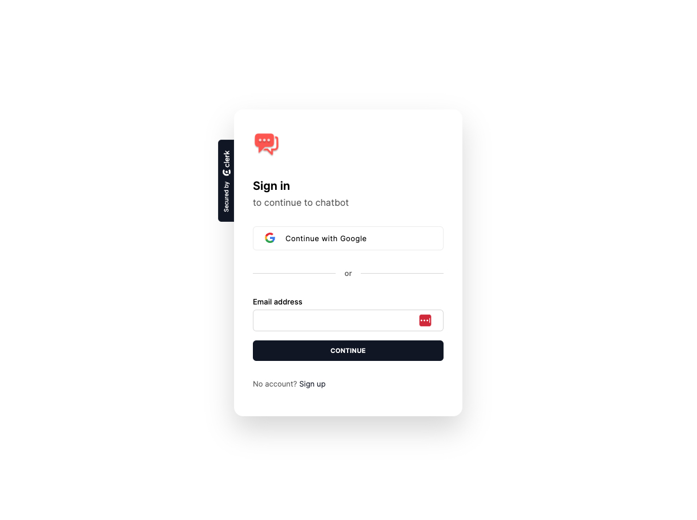
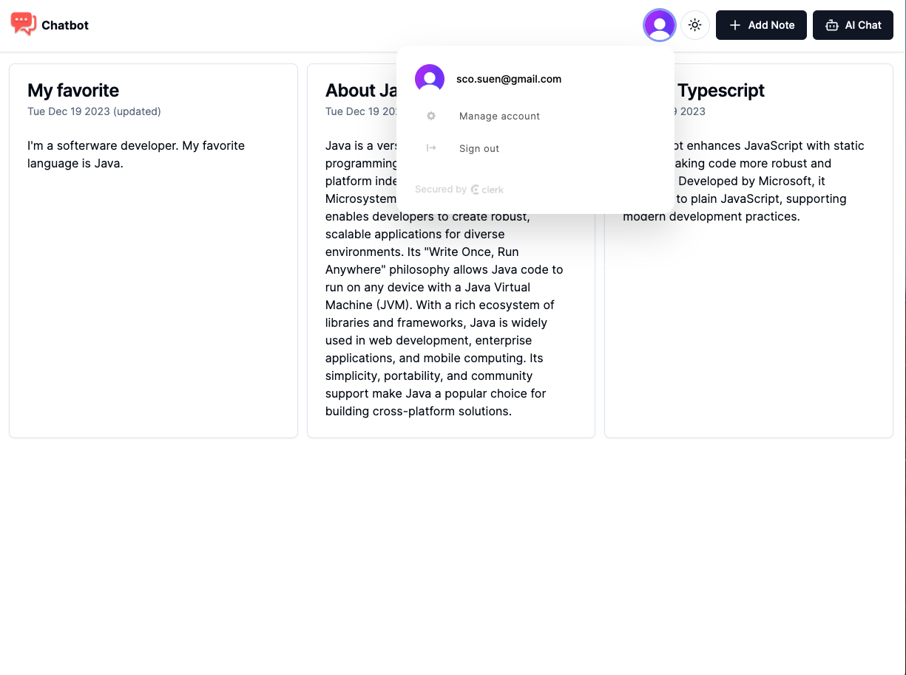

# Summary
Explore all-in-one app with seamless user management, note handling, light/dark theme, and AI chat. Effortlessly sign up, manage notes, and switch themes. Engage with AI for intelligent responses based on your notes. Elevate your experience for enhanced productivity.

# Teck Stack
- [OpenAI API]()
- [Vercel AI]()
- [Pinecone](https://www.pinecone.io/)
- [MongoDB](https://www.mongodb.com/)
- [Clerk](https://clerk.com)
- ReactJS 14
- Shadcn UI
- Tailwind
- Typescript
- zed
- Presma

# Features
- User Management 
  - Sign up
  - Sign in
  - Sign out
  - Manage account
- Note
  - Add a new note
  - Update note
  - Delete note
- Light/Dark theme
- AI Chat
  - Ask AI questions 
  - AI answer you based on your notes

## Screenshots
- Landing Page
  
- Chatbot
  
- New note
  
- Edit note
  
- Dark Theme
  
- Notes
  
- Sign In
  
- Sign out
  

# Getting Started
1. Installation
```shell
npm install
```

2. Run the development server
```shell
npm run dev
```

3. Open page with your browser to see the result.
  - [http://localhost:3000](http://localhost:3000)


# Reference
The project is based on this [YouTube Tutorial](https://youtu.be/mkJbEP5GeRA?si=IY5-_swNiSVgkpHv)
